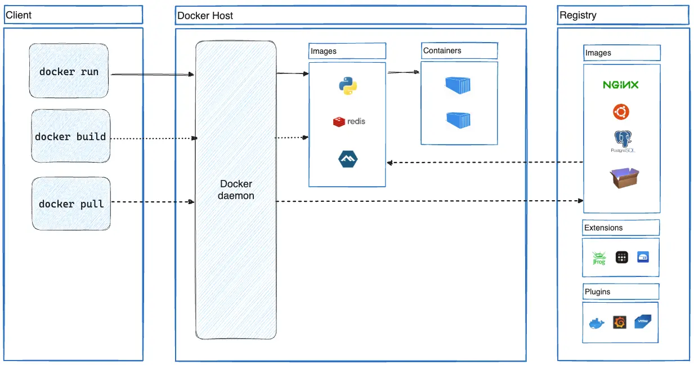

# docker-collection

## Table of Contents

1. [What is docker](#what-is-docker)
1. [High-level architecture](#high-level-architecture)
1. Key docker objects
    1. Image
    2. Container
    3. Registry
1. Image building
    1. Dockerfile basic syntax: FROM, ARG, ENV, RUN, EXPOSE, WORKDIR, ADD, COPY, ENTRYPOINT
    2. Dockerignore
    3. Multi-stage builds
1. CLI basics: build, run, stop, image, volume, ps, stats

1. Application data management
    1. Volumes
    1. Bind mounts
1. Networking overview
    1. Network drives
       1. Bridge
       1. Host
   1. Port publishing

## What is docker

Docker is an open platform for developing, shipping, and running applications.
The isolation and security lets you run many containers simultaneously on a given host.
Containers are lightweight and contain everything needed to run the application, so you don't need to rely on what's installed on the host.

### High-level architecture

docker client -> docker host -> registry



- The Docker daemon (dockerd) listens for Docker API requests and manages Docker objects such as images, containers, networks, and volumes.
  A
  daemon can also communicate with other daemons to manage Docker services.
- The Docker client (docker) is the primary way that many Docker users interact with Docker. When you use commands such as docker run, the
  client sends these commands to dockerd, which carries them out. The docker command uses the Docker API. The Docker client can communicate
  with more than one daemon.
- A Docker registry stores Docker images.

## Key docker objects

When you use Docker, you are creating and using

- images,
- containers,
- networks,
- volumes,
- plugins,
- and other objects.

### Images

An image is a read-only template with instructions for creating a Docker container. Often, an image is based on another image, with some
additional customization.

### Containers

A container is a runnable instance of an image. You can create, start, stop, move, or delete a container using the Docker API or CLI.

### Registry

An image registry is a centralized location for storing and sharing your container images. It can be either public or private.

## Image building

Container images are composed of layers. And each of these layers, once created, are immutable.
Each layer in an image contains a set of filesystem changes - additions, deletions, or modifications.
This is beneficial because it allows layers to be reused between images.This will make builds faster and reduce the amount of storage and
bandwidth required to distribute the images.

### Dockerfile basic syntax: FROM, ARG, ENV, RUN, EXPOSE, WORKDIR, ADD, COPY, ENTRYPOINT

[Documentation](https://docs.docker.com/reference/dockerfile/)

| Command    | Description                                            | Example                                   |
|------------|--------------------------------------------------------|-------------------------------------------|
| FROM       | Create a new build stage from a base image.            | FROM ubuntu:latest                        |
| ARG        | Use build-time variables.                              | ARG APP_VERSION=1.0                       |
| ENV        | Set environment variables.                             | ENV APP_ENV=production                    |
| RUN        | Execute build commands.                                | RUN apt update && apt install -y nginx    |
| EXPOSE     | Describe which ports your application is listening on. | 80/tcp                                    |
| WORKDIR    | Change working directory.                              | WORKDIR /app                              |
| ADD        | Add local or remote files and directories.             | ADD myfile.tar.gz /app/                   |
| COPY       | Copy files and directories.                            | COPY index.html /var/www/html/            |
| ENTRYPOINT | Specify default executable.                            | ENTRYPOINT ["nginx", "-g", "daemon off;"] |

Notes:

- Multistage build (multiple FROM in single file)

```
FROM golang AS builder
WORKDIR /app
COPY . .
RUN go build -o myapp

FROM alpine
COPY --from=builder /app/myapp /myapp
CMD ["/myapp"]
```

- ARG exists only on build step.

```
RUN echo "Version: $APP_VERSION"  # work
CMD echo "Version: $APP_VERSION"  # doesn't work
```

It possible to use ARG in FROM

```
ARG UBUNTU_VERSION=22.04
FROM ubuntu:$UBUNTU_VERSION
```

- ENV is shown in docker inspect, so don't keep sensitive information here
- RUN. Each RUN creates a new layer, so try to group this command

```
RUN apt update && \
    apt install -y curl && \
    rm -rf /var/lib/apt/lists/*
```

- EXPOSE is just documentation command, don't expose port in a fact
- WORKDIR use relative path

```
WORKDIR /app
WORKDIR logs  # now is /app/logs
```

- ADD can use URL and do auto unzip for an archive files

```
ADD https://example.com/file.tar.gz /app/ 
```

- CMD is a default behaviour, so it can be overrided by start command :

```
docker run myapp echo "Hello, World!"
```

- ENTRYPOINT is executed anyway

 ```
ENTRYPOINT ["nginx", "-g", "daemon off;"]
``` 

``docker run myapp -v`` will be  ``nginx -g "daemon off;" -v``

### Dockerignore

You can use a .dockerignore file to exclude files or directories from the build context.
example

```aiignore
secret.txt
node_modules/

folder/*
!folder/.keep
*.log
```

### Multi-stage builds

With multi-stage builds, you use multiple FROM statements in your Dockerfile. Each FROM instruction can use a different base, and each of
them begins a new stage of the build. You can selectively copy artifacts from one stage to another, leaving behind everything you don't want
in the final image.

The following Dockerfile has two separate stages: one for building a binary, and another where the binary gets copied from the first stage
into the next stage.

```
# syntax=docker/dockerfile:1
FROM golang:1.23
WORKDIR /src
COPY <<EOF ./main.go
package main

import "fmt"

func main() {
fmt.Println("hello, world")
}
EOF
RUN go build -o /bin/hello ./main.go

FROM scratch
COPY --from=0 /bin/hello /bin/hello
CMD ["/bin/hello"]
```

You only need the single Dockerfile. No need for a separate build script. Just run docker build.

docker build -t hello .

The end result is a tiny production image with nothing but the binary inside. None of the build tools required to build the application are
included in the resulting image.

By default, the stages aren't named, and you refer to them by their integer number, starting with 0 for the first FROM instruction. However,
you can name your stages, by adding an AS <NAME> to the FROM instruction.

``FROM golang:1.23 AS build``

### Stop at specific stage

When you build your image, you don't necessarily need to build the entire Dockerfile including every stage. You can specify a target build
stage. The following command assumes you are using the previous Dockerfile but stops at the stage named build:

``docker build --target build -t hello .``

Using another image
``COPY --from=nginx:latest /etc/nginx/nginx.conf /nginx.conf``
You can pick up where a previous stage left off by referring to it when using the FROM directive. For example:

```aiignore
FROM alpine:latest AS builder
RUN apk --no-cache add build-base

FROM builder AS build1
COPY source1.cpp source.cpp
RUN g++ -o /binary source.cpp

FROM builder AS build2
COPY source2.cpp source.cpp
RUN g++ -o /binary source.cpp
```

### Differences between legacy builder and BuildKit

The legacy Docker Engine builder processes all stages of a Dockerfile leading up to the selected --target. It will build a stage even if the
selected target doesn't depend on that stage. [BuildKit](https://docs.docker.com/build/buildkit/) only builds the stages that the target
stage depends on.

```aiignore
# syntax=docker/dockerfile:1
FROM ubuntu AS base
RUN echo "base"

FROM base AS stage1
RUN echo "stage1"

FROM base AS stage2
RUN echo "stage2"
```

With BuildKit enabled, building the stage2 target in this Dockerfile means only base and stage2 are processed. There is no dependency on
stage1, so it's skipped. On the other hand, building the same target without BuildKit results in all stages being processed. The legacy
builder processes stage1, even if stage2 doesn't depend on it.

## CLI basics: build, run, stop, image, volume, ps, ps

### build

The docker buildx build command starts a build using BuildKit.
``Usage	docker buildx build [OPTIONS] PATH | URL | -``
Aliases:
docker build
docker builder build
docker image build
docker buildx b

``docker buildx build -f <filepath> .``

tag format ``[HOST[:PORT_NUMBER]/]PATH[:TAG]``

- HOST: The optional registry hostname where the image is located. If no host is specified, Docker's public registry at docker.io is used by
  default.
- PORT_NUMBER: The registry port number if a hostname is provided
- PATH: The path of the image, consisting of slash-separated components. For Docker Hub, the format follows [NAMESPACE/]REPOSITORY, where
  namespace is either a user's or organization's name. If no namespace is specified, library is used, which is the namespace for Docker
  Official Images.
- TAG: A custom, human-readable identifier that's typically used to identify different versions or variants of an image. If no tag is
  specified, latest is used by default.
  ``docker/welcome-to-docker``, equivalent to ``docker.io/docker/welcome-to-docker:latest``


  ``docker build -t my-username/my-image .``

### run

The docker run command runs a command in a new container, pulling the image if needed and starting the container.

### stop

The main process inside the container will receive SIGTERM, and after a grace period, SIGKILL. The first signal can be changed with the
STOPSIGNAL instruction in the container's Dockerfile, or the --stop-signal option to docker run and docker create.

### image

Manage images

| Command   | Description                                                              |
|-----------|--------------------------------------------------------------------------|
| `build`   | Build an image from a Dockerfile                                         |
| `history` | Show the history of an image                                             |
| `import`  | Import the contents from a tarball to create a filesystem image          |
| `inspect` | Display detailed information on one or more images                       |
| `load`    | Load an image from a tar archive or STDIN                                |
| `ls`      | List images                                                              |
| `prune`   | Remove unused images                                                     |
| `pull`    | Download an image from a registry                                        |
| `push`    | Upload an image to a registry                                            |
| `rm`      | Remove one or more images                                                |
| `save`    | Save one or more images to a tar archive (streamed to STDOUT by default) |
| `tag`     | Create a tag TARGET_IMAGE that refers to SOURCE_IMAGE                    |

### volume

| Command                 | Description                                         |
|-------------------------|-----------------------------------------------------|
| `docker volume create`  | Create a volume                                     |
| `docker volume inspect` | Display detailed information on one or more volumes |
| `docker volume ls`      | List volumes                                        |
| `docker volume prune`   | Remove unused local volumes                         |
| `docker volume rm`      | Remove one or more volumes                          |
| `docker volume update`  | Update a volume (cluster volumes only)              |

For example, the following creates a tmpfs volume called foo with a size of 100 megabyte and uid of 1000.

```aiignore
 docker volume create --driver local \
    --opt type=tmpfs \
    --opt device=tmpfs \
    --opt o=size=100m,uid=1000 \
    foo
```

### ps

List containers

### stats

The docker stats command returns a live data stream for running containers. To limit data to one or more specific containers, specify a list
of container names or ids separated by a space. You can specify a stopped container but stopped containers do not return any data.

## Application data management

### Volumes

Volumes are persistent data stores for containers, created and managed by Docker. You can create a volume explicitly using the docker volume
create command, or Docker can create a volume during container or service creation.

When you create a volume, it's stored within a directory on the Docker host. When you mount the volume into a container, this directory is
what's mounted into the container. This is similar to the way that bind mounts work, except that volumes are managed by Docker and are
isolated from the core functionality of the host machine
Volumes are a good choice for the following use cases:

- Volumes are easier to back up or migrate than bind mounts.
- You can manage volumes using Docker CLI commands or the Docker API.
- Volumes work on both Linux and Windows containers.
- Volumes can be more safely shared among multiple containers.
- New volumes can have their content pre-populated by a container or build.
- When your application requires high-performance I/O.

Volumes are not a good choice if you need to access the files from the host, as the volume is completely managed by Docker.

A given volume can be mounted into multiple containers simultaneously. When no running container is using a volume, the volume is still
available to Docker and isn't removed automatically. You can remove unused volumes using docker volume prune.

If you mount an empty volume into a directory in the container in which files or directories exist, these files or directories are
propagated (copied) into the volume by default. Similarly, if you start a container and specify a volume which does not already exist, an
empty volume is created for you. This is a good way to pre-populate data that another container needs.

To mount a volume with the docker run command, you can use either the --mount or --volume flag.

```
docker run --mount type=volume,src=<volume-name>,dst=<mount-path>
docker run --volume <volume-name>:<mount-path>
```

Volumes are useful for backups, restores, and migrations. Use the --volumes-from flag to create a new container that mounts that volume.

### Bind mounts

When you use a bind mount, a file or directory on the host machine is mounted from the host into a container. By contrast, when you use a
volume, a new directory is created within Docker's storage directory on the host machine, and Docker manages that directory's contents.

Bind mounts have write access to files on the host by default.

One side effect of using bind mounts is that you can change the host filesystem via processes running in a container, including creating,
modifying, or deleting important system files or directories. This capability can have security implications. For example, it may affect
non-Docker processes on the host system.

You can use the readonly or ro option to prevent the container from writing to the mount.
Bind mounts are created to the Docker daemon host, not the client.

If you're using a remote Docker daemon, you can't create a bind mount to access files on the client machine in a container.
To create a bind mount, you can use either the --mount or --volume flag.

```
docker run --mount type=bind,src=<host-path>,dst=<container-path>
docker run --volume <host-path>:<container-path>
```

## Networking overview

Container networking refers to the ability for containers to connect to and communicate with each other, or to non-Docker workloads.
Containers have networking enabled by default, and they can make outgoing connections. A container has no information about what kind of
network it's attached to, or whether their peers are also Docker workloads or not. A container only sees a network interface with an IP
address, a gateway, a routing table, DNS services, and other networking details. That is, unless the container uses the none network driver.

You can create custom, user-defined networks, and connect multiple containers to the same network. Once connected to a user-defined network,
containers can communicate with each other using container IP addresses or container names.

The following example creates a network using the bridge network driver and running a container in the created network:

```
docker network create -d bridge my-net
docker run --network=my-net -itd --name=container3 busybox
```

A container can be connected to multiple networks.

For example, a frontend container may be connected to a bridge network with external access, and a --internal network to communicate with
containers running backend services that do not need external network access.
The default gateway is selected by Docker, and may change whenever a container's network connections change. To make Docker choose a
specific default gateway when creating the container or connecting a new network, set a gateway priority.
The default gw-priority is 0 and the gateway in the network with the highest priority is the default gateway. So, when a network should
always be the default gateway, it is enough to set its gw-priority to 1.

```
docker run --network name=gwnet,gw-priority=1 --network anet1 --name myctr myimage
docker network connect anet2 myctr
```

In addition to user-defined networks, you can attach a container to another container's networking stack directly, using the ``--network
container:<name|id>`` flag format.

### Network drives

The following network drivers are available by default, and provide core networking functionality:

| Network Driver | Description                                                                                                                  |
|----------------|------------------------------------------------------------------------------------------------------------------------------|
| `bridge`       | The default network driver. Containers on this network can communicate with each other and with the Docker host.             |
| `host`         | Removes network isolation between the container and the Docker host, using the host's networking stack.                      |
| `none`         | Completely isolates a container from the host and other containers, with no network access.                                  |
| `overlay`      | Overlay networks connect multiple Docker daemons together, allowing containers to communicate across different Docker hosts. |
| `ipvlan`       | IPvlan networks provide full control over both IPv4 and IPv6 addressing, and containers can have their own IP addresses.     |
| `macvlan`      | Assigns a unique MAC address to a container, allowing it to appear as a physical device on the network.                      |

- Bridge   
  In terms of Docker, a bridge network uses a software bridge which lets containers connected to the same bridge network communicate, while
  providing isolation from containers that aren't connected to that bridge network. The Docker bridge driver automatically installs rules in
  the host machine so that containers on different bridge networks can't communicate directly with each other.
  Bridge networks apply to containers running on the same Docker daemon host. For communication among containers running on different Docker
  daemon hosts, you can either manage routing at the OS level, or you can use an overlay network.

- Host

  If you use the host network mode for a container, that container's network stack isn't isolated from the Docker host (the container shares
  the host's networking namespace), and the container doesn't get its own IP-address allocated. For instance, if you run a container which
  binds to port 80 and you use host networking, the container's application is available on port 80 on the host's IP address.
  port-mapping doesn't take effect, and the -p, --publish, -P, and --publish-all option are ignored, producing a warning instead:

  ``WARNING: Published ports are discarded when using host network mode``

  Host mode networking can be useful for the following use cases:

    - To optimize performance
    - In situations where a container needs to handle a large range of ports.

  This is because it doesn't require network address translation (NAT), and no "userland-proxy" is created for each port.

  This creates some extra limitations. For instance, if a service container binds to port 80, only one service container can run on a given
  swarm node.

  The host networking driver is supported on Docker Engine (Linux only) and Docker Desktop version 4.34 and later.

### Port publishing

Publishing a port provides the ability to break through a little bit of networking isolation by setting up a forwarding rule. As an example,
you can indicate that requests on your host’s port 8080 should be forwarded to the container’s port 80. Publishing ports happens during
container creation using the -p (or --publish) flag with docker run. The syntax is:

``docker run -d -p HOST_PORT:CONTAINER_PORT nginx``

- HOST_PORT: The port number on your host machine where you want to receive traffic
- CONTAINER_PORT: The port number within the container that's listening for connections
  For example, to publish the container's port 80 to host port 8080:

``docker run -d -p 8080:80 nginx``

At times, you may want to simply publish the port but don’t care which host port is used. In these cases, you can let Docker pick the port
for you. To do so, simply omit the HOST_PORT configuration.
``docker run -p 80 nginx``

Once the container is running, using docker ps will show you the port that was chosen.

When creating a container image, the EXPOSE instruction is used to indicate the packaged application will use the specified port. These
ports aren't published by default.

With the -P or --publish-all flag, you can automatically publish all exposed ports to ephemeral ports. This is quite useful when you’re
trying to avoid port conflicts in development or testing environments.

For example, the following command will publish all of the exposed ports configured by the image:

``docker run -P nginx``